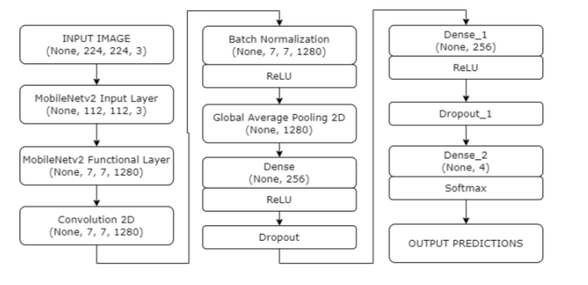
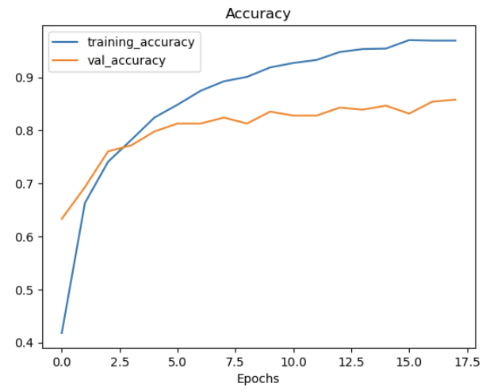
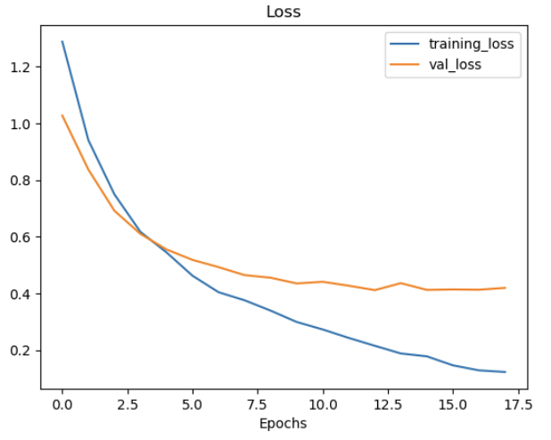
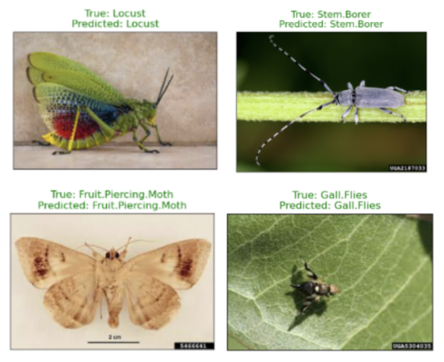

# Locust Prediction

## Data

- Pests Identification Datatset: https://www.kaggle.com/datasets/abhinandanroul/pest-normalized
- 1669 labelled images of four distinct pest categories: Fruit Piercing Moth (374 images), Gall Flies (490 images),Locust (331 images), and Stem Borer (474 images). 
- Each category represents a specific type of agricultural pest that can significantly impact crop health and productivity.

## Transfer Learning - Fine-tuning MobileNetv2 using Keras

- Froze the initial layers of MobileNetV2 to prevent their weights from being updated during training. 
- Added a custom fully connected layer on top, for the classifier specifically designed for our target dataset.
- Adam optimizer with a learning rate of 0.0001. 
- To prevent over fitting, we employed early stopping with a patience of 5 epochs, monitoring the validation accuracy.  
- Batch size of 32, the model was trained for 18 epochs. 

## Results

